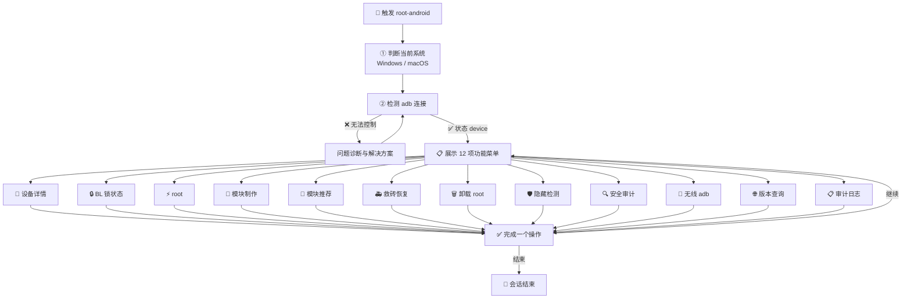

<div align="center">

# 🔓 Root Android

**面向 Codex 的 Android root 全流程技能包**

从设备检测、BL 解锁到救砖恢复，一站式安全引导，每一步都带强制安全验证。

[](https://github.com/Stone-People-Like/root-android)
[](https://github.com/Stone-People-Like/root-android/releases)
[](https://github.com/Stone-People-Like/root-android)
[](https://github.com/Stone-People-Like/root-android)
[](https://developer.android.com/)
[](https://github.com/topjohnwu/Magisk)
[](https://github.com/tiann/KernelSU)
[]()
[](https://www.gnu.org/licenses/gpl-3.0)

</div>

---

## 📖 项目简介

`root-android` 是一个 Codex 技能（Skill），把 Android 设备 root 的完整链路封装成一套**菜单驱动**的引导流程。调用后自动检测环境与 adb 连接，确认可控后再展开 12 项功能，涉及写入/刷写/安装的操作全部经过强制安全验证，最大限度降低变砖风险。

> ✅ 已适配：macOS / Windows
> ✅ 已支持：Magisk、KernelSU、TWRP
> ✅ 内置：品牌解锁政策库、救砖指南、模块安全审计、操作审计日志

## ✨ 功能菜单

| # | 功能 | 说明 |
| :-: | --- | --- |
| 1 | 📱 查看手机详细数据 | 一键采集品牌、型号、系统、内核、电池、root 状态 |
| 2 | 🔒 BL 锁状态 | 只读检查 bootloader 锁定与验证状态 |
| 3 | ⚡ root | 四步安全流程：系统检测 → adb 验证 → 三套方案 → 风险告知 |
| 4 | 🧩 自定义模块制作 | 骨架生成、module.prop、脚本模板、自动打包 |
| 5 | 🌟 模块推荐 | 按设备兼容性推荐可信 Magisk 模块 |
| 6 | 🚑 救砖与恢复 | fastboot / EDL-9008 / MTK / Odin 分级救援 |
| 7 | 🗑️ 卸载 root / 恢复原厂 | Magisk 卸载、还原 boot、可选重锁 BL |
| 8 | 🛡️ root 隐藏与完整性检测 | Play Integrity 检测、Zygisk + DenyList / Shamiko |
| 9 | 🔍 模块安全审计 | 恶意特征识别、脚本代码审查清单 |
| 10 | 📡 无线 adb 连接 | `adb pair` + `adb connect` 全程引导 |
| 11 | 🌐 外部信息与版本查询 | Magisk/KernelSU 最新版本、官方固件下载源 |
| 12 | 📋 操作审计日志 | 每次刷写/安装自动留痕，便于复盘 |

## 🔄 工作流程



## 🚀 快速开始

### 0. 给 AI Agent 的一句话安装指令

> 🤖 请克隆 https://github.com/Stone-People-Like/root-android 并将其中的 `root-android` 目录软链到 `~/.codex/skills/root-android`，让 Codex 能自动发现并使用这个技能。

### 1. 安装到 Codex

将本仓库软链或复制到 Codex 的 skills 目录（二选一）：

```bash
# 方式一：软链（推荐，改动即时生效）
ln -s "$(pwd)/root-android" ~/.codex/skills/root-android

# 方式二：直接复制
cp -r root-android ~/.codex/skills/root-android
```

### 2. 使用

新开一个 Codex 对话，直接说：

> 用 `$root-android` 帮我 root 手机

技能会自动执行：**环境检测 → adb 连接验证 → 展示功能菜单**，你选择对应数字即可。

## 🗂️ 项目结构

```
root-android/
├── SKILL.md                  # 技能主文件（菜单 + 流程 + 安全规则）
├── agents/
│   └── openai.yaml           # UI 元数据
├── scripts/                  # 自动化脚本（可直接执行）
│   ├── check_environment.sh      # 环境检测
│   ├── collect_device_info.sh    # 设备信息采集
│   ├── backup_images.sh          # 分区镜像备份
│   ├── restore_images.sh         # 原版镜像回滚
│   ├── build_magisk_module.sh    # 模块构建打包
│   ├── check_latest_versions.sh  # 版本查询
│   └── log_operation.sh          # 操作审计日志
├── references/               # 按需加载的知识库
│   ├── vendors.md                # 品牌解锁政策
│   ├── rescue.md                 # 救砖指南
│   ├── unroot.md                 # 卸载 root
│   ├── root-hiding.md            # root 隐藏
│   ├── module-security.md        # 模块安全审计
│   ├── module-api.md             # 模块 API 参考
│   ├── wireless-adb.md           # 无线 adb
│   └── external-info.md          # 外部信息查询
└── assets/
    └── module-template/          # Magisk 模块模板
        ├── module.prop
        ├── customize.sh
        ├── service.sh
        ├── post-fs-data.sh
        └── META-INF/.../update-binary
```

## 🛠️ 脚本速查

| 脚本 | 功能 | 示例 |
| --- | --- | --- |
| `check_environment.sh` | 检测系统与 adb/fastboot | `./scripts/check_environment.sh` |
| `collect_device_info.sh` | 采集设备信息 | `./scripts/collect_device_info.sh` |
| `backup_images.sh` | 备份 boot/recovery | `./scripts/backup_images.sh boot` |
| `restore_images.sh` | 回滚原版镜像 | `./scripts/restore_images.sh boot boot-backup.img --yes` |
| `build_magisk_module.sh` | 生成并打包模块 | `./scripts/build_magisk_module.sh my_mod "My Mod" alice` |
| `check_latest_versions.sh` | 查询最新版本 | `./scripts/check_latest_versions.sh` |
| `log_operation.sh` | 记录操作日志 | `./scripts/log_operation.sh "刷入 boot"` |

## 📚 知识库索引

| 文档 | 适用场景 |
| --- | --- |
| `references/vendors.md` | 不确定品牌是否可解锁时 |
| `references/rescue.md` | 设备变砖、卡 logo、无法开机时 |
| `references/unroot.md` | 想恢复原厂、卸载 root 时 |
| `references/root-hiding.md` | 银行/支付应用检测到 root 时 |
| `references/module-security.md` | 安装第三方模块前审计 |
| `references/module-api.md` | 自己写 Magisk 模块时 |
| `references/wireless-adb.md` | 不想插线、想无线调试时 |
| `references/external-info.md` | 找固件、查机型教程时 |

## ⚠️ 安全须知

> 🔞 **仅限本人设备**：只对你拥有或获得授权的设备执行。
>
> 💾 **先备份**：解锁 bootloader 与刷写会清空全部数据。
>
> 🧱 **变砖风险**：错误镜像、错误分区、刷写中断都可能导致设备无法开机。
>
> 🏷️ **保修失效**：root 通常使保修失效；三星等机型存在不可逆的熔断。
>
> 🔐 **应用受限**：银行、支付、部分游戏会检测 root 并拒绝运行。

本技能的安全设计：

- ✅ 每步操作前有强制安全验证检查点
- ✅ 刷写前自动提示备份原版镜像
- ✅ 操作失败立即停止，不盲目重试
- ✅ 每次写入/刷写/安装自动记录审计日志

## ❓ 常见问题

**Q：无线 adb 能用来刷机吗？**

不能。无线 adb 只支持 shell、传输等操作，刷写 boot/recovery 必须使用 USB 连接 fastboot。

**Q：root 隐藏一定有效吗？**

不保证。basic/device integrity 有较大概率隐藏成功，但 strong integrity 基于硬件级证明，基本无法绕过。

**Q：我的品牌在知识库里没有怎么办？**

技能会先查官方与 XDA 社区资料再动手；找不到可靠方案时会明确告知风险并建议停止。

**Q：出问题了能救回来吗？**

大多数软件层问题可以通过 fastboot/EDL/MTK/Odin 恢复，技能内置分级救砖指南；需要厂商授权的场景会建议走官方售后。

## 🤝 贡献

欢迎提交 PR 扩充：

- 新的品牌解锁案例（`references/vendors.md`）
- 新的救砖实战经验（`references/rescue.md`）
- 更完善的自动化脚本（`scripts/`）
- 高质量的模块模板（`assets/`）

## 📜 免责声明

本项目仅用于学习和研究。作者不对因使用本项目造成的设备损坏、数据丢失、保修失效或其他损失负责。请在充分理解风险并获得设备所有者授权的前提下使用。

## 📄 开源协议

本项目采用 **GNU General Public License v3.0（GPL-3.0）** 开源。

- ✅ 允许商用
- ✅ 允许修改与二次开发
- 🔗 但分发修改版/衍生作品时，必须同样以 GPL-3.0 协议开源

完整的协议文本见 [LICENSE](LICENSE)。

---

<div align="center">

**如果这个项目对你有帮助，欢迎 ⭐ Star 支持！**

</div>
